  

# 🛡️ Awesome Governance, Risk & Compliance (GRC) 🚀

  
  
  
  
  

> 📚 **The Definitive Ecosystem Guide to GRC Automation, Risk Management, Security Control Monitoring & Open-Source Compliance.**

Welcome to the **Awesome Governance, Risk & Compliance (GRC)** repository! This curated directory tracks leading **SaaS platforms**, enterprise security compliance software, and high-impact **open-source GitHub projects**. Designed for CISOs, compliance officers, security engineers, and startup founders needing SOC 2, ISO 27001, HIPAA, GDPR, PCI DSS, and NIS2 readiness.

---

## 📌 Table of Contents

- [📊 Industry & Market Insights](#-industry--market-insights)
- [🏢 SaaS & Hosted GRC Platforms](#-saas--hosted-grc-platforms)
- [💻 Open-Source GitHub Projects](#-open-source-github-projects)
- [🛠️ Recommended Architecture & Frameworks](#%EF%B8%8F-recommended-architecture--frameworks)
- [🤝 How to Contribute](#-how-to-contribute)
- [💖 Support & Community](#-support--community)
- [📈 Star History](#-star-history)
- [⚠️ Disclaimer](#%EF%B8%8F-disclaimer)

---

## 📊 Industry & Market Insights

> 💡 **Market Size & Structure**: The global **Governance, Risk & Compliance (GRC)** market is estimated at **$54.6 Billion (2025/2026)** and projected to reach **$134.8 Billion by 2033** (CAGR ~11.8%). The market is **moderately fragmented**, featuring established enterprise incumbents (ServiceNow, MetricStream, OneTrust, AuditBoard) alongside rapidly growing automated compliance category disruptors (Vanta, Drata, Secureframe).

---

## 🏢 SaaS & Hosted GRC Platforms

The table below outlines leading SaaS platforms ranked by company scale (Valuation / Revenue) descending:

| 🏢 Platform | 💰 Scale (Valuation / Revenue) | 💵 Starting Tier Pricing | 🎁 Free Tier / Trial Limit | 🎯 Core Focus & Features |
| :--- | :--- | :--- | :--- | :--- |
| **[ServiceNow GRC](https://www.servicenow.com/)** | **$160B+ Valuation** (~$10.9B Rev) | ~$30,000 / year (Enterprise quote) | ❌ No free tier; demo environment available on request | Enterprise risk management, policy compliance, and automated audit workflows integrated into ITSM. |
| **[OneTrust](https://www.onetrust.com/)** | **$4.5B Valuation** (~$500M+ ARR) | ~$400 / month (Privacy modules) | ❌ No free tier; 14-day limited feature demo upon approval | Data governance, privacy compliance (GDPR, CCPA), and automated consent management. |
| **[Drata](https://drata.com/)** | **$2.0B Valuation** (~$100M+ ARR) | ~$7,500 / year (Growth plan) | ⌛ 14-day free trial (requires sales onboarding demo) | Automated evidence collection with 100+ integrations covering SOC 2, ISO 27001, HIPAA, and PCI DSS. |
| **[Vanta](https://www.vanta.com/)** | **$1.6B Valuation** (~$100M+ ARR) | ~$7,500 / year (Starter plan) | ⌛ 7-day interactive demo / trial on request | Startup & mid-market continuous control monitoring, Trust Center, and automated SOC 2 / ISO 27001 evidence. |
| **[AuditBoard](https://www.auditboard.com/)** | **$3.0B Acquisition** (~$200M ARR) | ~$15,000 / year (Standard seat base) | ❌ No free tier; custom sandbox environment upon request | Connected internal audit, SOX compliance management, and enterprise risk workflow automation. |
| **[MetricStream](https://www.metricstream.com/)** | **~$150M+ Revenue** (PE Backed) | ~$25,000 / year (Enterprise entry) | ❌ No free tier; guided enterprise sandbox available | Cyber risk quantification, regulatory compliance, and financial industry risk governance. |
| **[Secureframe](https://secureframe.com/)** | **$1.0B Valuation** (~$40M+ ARR) | ~$6,000 / year (Essentials plan) | ⌛ 14-day standard free trial for qualified accounts | AI-powered compliance automation, continuous risk assessment, and vendor risk management. |
| **[Hyperproof](https://hyperproof.io/)** | **~$40M ARR** (Series B) | ~$10,000 / year (Core plan) | ⌛ 14-day trial available via sales enablement | Cross-framework control mapping, audit preparation, and multi-standard evidence re-use. |
| **[LogicGate Risk Cloud](https://www.logicgate.com/)** | **~$30M ARR** (Series C) | ~$12,000 / year (Base platform) | ❌ No free tier; personalized sandbox access via demo | No-code GRC application builder for customizable governance workflows and risk registers. |
| **[ZenGRC](https://www.zengrc.com/)** | **~$25M ARR** (RiskOptics) | ~$10,000 / year (Mid-market plan) | ❌ No free tier; guided test drive available | Mid-market compliance automation, risk tracking, and unified control hierarchy management. |

---

## 💻 Open-Source GitHub Projects

Below is a curated list of top open-source GRC software, framework parsers, and security compliance tools ranked by **GitHub Star Count (descending)**:

| 📦 Repository & Link | ⭐ Star Count | 📜 License | 🚀 Key Capabilities & Overview |
| :--- | :--- | :--- | :--- |
| **[Gitleaks](https://github.com/gitleaks/gitleaks)** |  | MIT | SAST scanner for detecting secrets, API keys, and tokens in git repos for compliance enforcement. |
| **[Wazuh](https://github.com/wazuh/wazuh)** |  | GPL v2 | Open-source XDR and SIEM platform for threat detection, regulatory monitoring (PCI DSS, GDPR, NIST). |
| **[Datasette](https://github.com/simonw/datasette)** |  | Apache-2.0 | Multi-tool for exploring and publishing compliance databases, security control datasets, and audit logs. |
| **[OpenCTI](https://github.com/OpenCTI-Platform/opencti)** |  | Apache-2.0 | Open-source cyber threat intelligence (CTI) platform used for enterprise risk analysis and threat mapping. |
| **[DefectDojo](https://github.com/DefectDojo/django-DefectDojo)** |  | BSD 3-Clause | DevSecOps vulnerability management & audit orchestration platform mapping findings to compliance controls. |
| **[CISO Assistant](https://github.com/intuitem/ciso-assistant-community)** |  | AGPL v3 | Comprehensive GRC suite with **134+ compliance frameworks** (ISO 27001, NIST, NIS2, SOC 2) and control mapping. |
| **[ComplianceAsCode/content](https://github.com/ComplianceAsCode/content)** |  | Linux-OpenIB | SCAP and Ansible security baseline automation for PCI-DSS, NIST SP 800-53, HIPAA, and CIS benchmarks. |
| **[ArcherySec](https://github.com/archerysec/archerysec)** |  | MIT | Vulnerability assessment scanner orchestrator for developers & compliance audit readiness. |
| **[Comp AI](https://github.com/trycompai/comp)** |  | AGPL v3 | AI-native compliance platform alternative to Vanta/Drata with OS-level endpoint checking & policy editors. |
| **[Probo](https://github.com/getprobo/probo)** |  | ISC | Self-hostable GRC platform for engineering teams featuring 270+ MCP tools, CLI interface, and n8n nodes. |
| **[Openlane](https://github.com/theopenlane/core)** |  | Apache-2.0 | Go-based GraphQL compliance platform providing risk registers, asset cataloging, and entitlement APIs. |
| **[Compliance Trestle](https://github.com/oscal-compass/compliance-trestle)** |  | Apache-2.0 | IBM OSCAL-native python SDK & CLI to manage NIST compliance docs-as-code and automated control tracking. |
| **[Unicis Platform CE](https://github.com/UnicisTech/unicis-platform-ce)** |  | AGPL v3 | GRC open-source alternative for Statement of Applicability (SoA) export, audit logs, and compliance mapping. |
| **[ConsentOS](https://github.com/consentos/consentos)** |  | ELv2 | Self-hosted privacy & consent management system (OneTrust CMP alternative) supporting IAB TCF v2.3 & GDPR. |
| **[Cairn](https://github.com/frousselet/cairn)** |  | AGPL v3 | Django/HTMX self-hosted GRC platform enforcing record lifecycles for ISO 27001, GDPR, and NIS2 tracking. |
| **[Compliance Gap Analyzer](https://github.com/CyberEnthusiastic/compliance-gap-analyzer)** |  | MIT | Zero-dependency RAG policy analyzer performing TF-IDF cosine gap analysis against SOC 2 and ISO 27001. |

---

## 🛠️ Recommended Architecture & Frameworks

To build a zero-cost or hybrid enterprise GRC stack, consider combining these modular tools:
* **Core GRC & Audit Workflow**: [CISO Assistant](https://github.com/intuitem/ciso-assistant-community) or [Probo](https://github.com/getprobo/probo)
* **Vulnerability & Findings Management**: [DefectDojo](https://github.com/DefectDojo/django-DefectDojo)
* **Data Privacy & Consent**: [ConsentOS](https://github.com/consentos/consentos)
* **OSCAL Compliance-as-Code**: [Compliance Trestle](https://github.com/oscal-compass/compliance-trestle)
* **Policy Gap Analysis**: [Compliance Gap Analyzer](https://github.com/CyberEnthusiastic/compliance-gap-analyzer)

---

## 🤝 How to Contribute

Contributions are warmly welcome! 🎉
1. 🍴 **Fork** the repository.
2. 📝 **Add/edit** entries in `README.md` following the established table structure.
3. 🔗 **Ensure links** point directly to official documentation or active GitHub repositories.
4. 🚀 **Submit a Pull Request** with a clear explanation of your additions.

---

## 💖 Support & Community

If you find this repository helpful for your organization's security and compliance journey, please consider showing your support:

* ⭐ **Star this repository** to help others discover it.
* 🔀 **Fork & Share** it with security engineers, CISOs, and audit teams.
* 💬 **Join our Discord Community**: 
* ☕ **Buy me a coffee / Sponsor the project**:

Thank you for supporting open-source security & governance! 🙌

---

## 📈 Star History

---

## ⚠️ Disclaimer

- This is a **community-curated** list for educational and informational purposes — not exhaustive and not an endorsement.
- GRC platforms handle sensitive compliance and risk data; ensure proper access controls, audit logging, and data protection.
- Self-hosted open-source solutions require security hardening, regular updates, and compliance team ownership. Open-source GRC covers the software license, not the operational cost of running compliance programs.

---

  <b>Made with ❤️ for security engineers, compliance officers, CISOs, and startup founders.</b>

